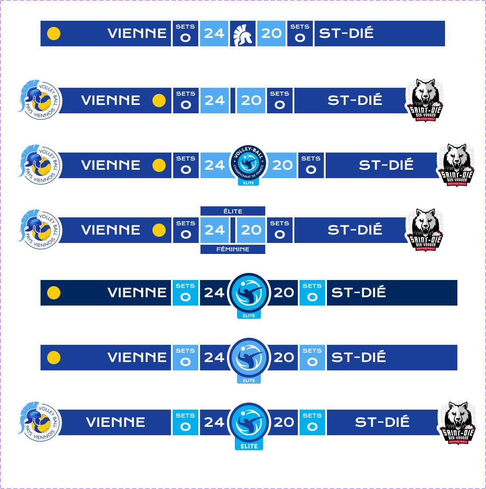

## Volleyball Scoreboard
### Main Idea
This project is meant to help Canal Vienne build an identity for the volleyball team of Vienne. Canal Vienne is broadcasting their games and was willing to improve the design of the scoreboard.

The website in itself is not made to be displayed through a regular browser, but instead through a browser element from OBS in order to be shown during broadcasts.

### Creation
I started by making different scoreboard concepts in Figma, and Canal Vienne settled for the last one.

Then, I transferred the design to HTML and CSS using [Anima](https://www.animaapp.com/), so I could directly dive into coding the interactions between a controller file and the display.

I used WebSocket to manage messages between files, and Express server to apply changes on the JSON data file during the use of the website. Http-Server allowed me to use the website on any device connected to the same network, simplifying the work for Canal Vienne.
That way, they were able to keep OBS open on the computer's main and only monitor and remote control the score at the same time.

### Conclusion
I really liked working on this project, it was far from what I am used to do, but very gratifying to understand each aspect of the different modules I got to deal with.